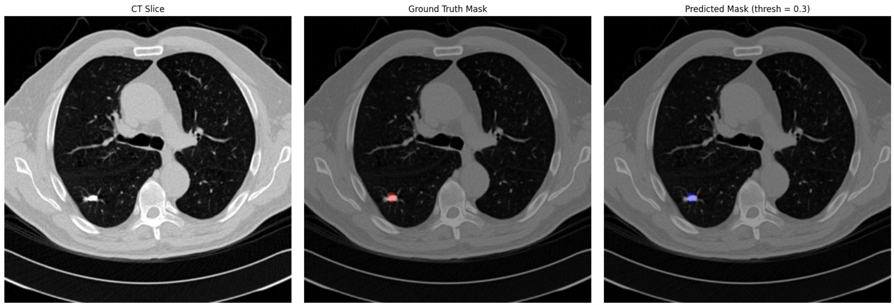

# CT-LNS
Preprocessing, patch-based dataset creation, and 3D U-Net training for lung nodule segmentation on CT scans.

## Overview

CT-LNS is a novel pipeline designed to enable accurate and automated **lung nodule segmentation** in 3D CT scans.  

Unlike conventional 2D approaches, CT-LNS leverages volumetric 3D information, patch extraction, and data augmentation to improve segmentation performance on limited and imbalanced datasets. The pipeline integrates preprocessing, patch-based dataset creation, and 3D U-Net training to provide a complete solution for lung nodule detection.

CT-LNS has been evaluated on annotated CT scans with diverse nodule sizes and locations, demonstrating reliable performance in segmenting nodules of varying shapes and intensities. The framework is robust, scalable, and suitable for both research and clinical-oriented medical image analysis projects.

## Features

- **CT Scan Preprocessing**:  
  Resampling, HU clipping, and normalization to standardize CT volumes for consistent input. Automatic mask generation from nodule annotations.

- **Patch-Based Dataset Creation**:  
  Generates 3D patches from full CT volumes to balance representation of nodules. Supports oversampling and patch augmentation to improve generalization.

- **3D U-Net Architecture**:  
  Encoder-decoder network with skip connections and double convolution blocks. Fully 3D convolutional layers capture volumetric features for precise segmentation.

- **Combined Loss Function**:  
  Dice + CrossEntropy loss optimized for nodule segmentation. Provides robust convergence even for small nodules.

- **Data Augmentation**:  
  Random flips along spatial axes, oversampling, and patch shuffling to enhance model generalization.

- **Training Pipeline**:  
  GPU-accelerated training using PyTorch, with mixed-precision for memory efficiency. Learning rate scheduling via ReduceLROnPlateau.

- **Evaluation Metrics**:  
  Dice coefficient, nodule voxel accuracy, and epoch-wise loss reporting for comprehensive performance assessment.

## Data

To evaluate and train the pipeline, CT-LNS requires annotated 3D CT scans:

- **Input format**: `.mhd` volumetric CT files  
- **Annotation format**: CSV file with columns: `seriesuid`, `coordX`, `coordY`, `coordZ`, `diameter_mm`

The preprocessing module resamples images, generates masks from annotations, normalizes intensities, and saves the results as `.npy` files suitable for patch-based dataset creation.

### Data Folder Structure

- `raw`  
  Raw data files:  
  - `.mhd` CT volumes  
  - `annotations.csv` containing nodule annotations

- `npy_preprocessed`  
  Preprocessed `.npy` files ready for training:  
  - `_img.npy` → preprocessed CT volume  
  - `_mask.npy` → corresponding nodule mask

### Dataset Source

The pipeline uses annotated 3D CT scans from the **LUNA16 subset5 dataset**:

- **Dataset page**: [LUNA16 Challenge](https://luna16.grand-challenge.org)  
- **CT volumes**: [subset5.zip](https://zenodo.org/records/3723295/files/subset5.zip?download=1)  
- **Annotations**: [annotations.csv](https://zenodo.org/records/3723295/files/annotations.csv?download=1)

### Notes

- To generate the preprocessed `.npy` files from `raw/`, run the preprocessing scripts in `src/utils.py`.  
- Ensure consistent folder paths in `config/config.yaml` before preprocessing.

## Requirements

The following libraries are required:

- Python >= 3.7  
- torch  
- torchvision  
- numpy  
- pandas  
- SimpleITK  
- torchio  
- napari (optional, for visualization)  
- tqdm  

Install dependencies via:

```bash
pip install -r requirements.txt
```

## Visualization

Here is an example of the CT-LNS preprocessing result:

[](visualization_result.jpeg)


